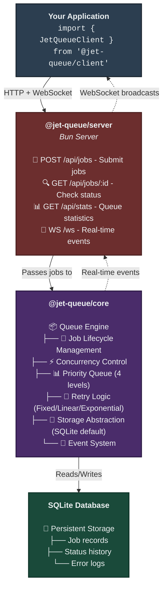

<div align="center">
  <h1>JetQueue</h1>
  <p>
    <a href="#packages">Packages</a> •
    <a href="#examples">Examples</a> •
    <a href="#api">API</a>
  </p>
  
  <p>
    
    
    
    
  </p>
</div>

---

## 🤔 What is JetQueue?

JetQueue is a background job processing system that lets you move heavy work out of your API's request/response cycle. Instead of making users wait 10 seconds for an email to send, you queue it and respond instantly.

**The Problem:**

```typescript
// ❌ Without a queue - user waits 5+ seconds
app.post("/signup", async (req, res) => {
  await createUser(req.body); // 100ms
  await sendWelcomeEmail(); // 2000ms
  await generateThumbnail(); // 3000ms
  res.json({ ok: true }); // User waited 5.1 seconds
});
```

**The Solution:**

```typescript
// ✅ With JetQueue - user waits 100ms
app.post("/signup", async (req, res) => {
  await createUser(req.body); // 100ms
  queue.add("send-welcome-email", { data: req.body });
  queue.add("generate-thumbnail", { data: req.body });
  res.json({ ok: true }); // User waited 100ms!
});
```

## ✨ Features

- **Concurrent Processing** - Run N jobs simultaneously
- **Auto-Retry** - Exponential, linear, or fixed backoff strategies
- **Priority Queues** - Critical jobs jump the line
- **Delayed & Recurring Jobs** - Schedule work for later
- **Persistent Storage** - SQLite for durability, in-memory for speed
- **Real-time Events** - WebSocket updates for live monitoring
- **CLI Dashboard** - Monitor queues right in your terminal
- **Web Dashboard** - Next.js monitoring UI
- **REST API** - Use from any language, not just TypeScript
- **Dev-friendly configuration** - supports env variables and file based cofiguration

## 📦 Packages

| package                | description                   | npm                                               |
| ---------------------- | ----------------------------- | ------------------------------------------------- |
| `@jet-queue/core`      | Core queue engine             |  |
| `@jet-queue/server`    | REST API + WebSocket server   |  |
| `@jet-queue/client`    | TypeScript SDK for the server |  |
| `@jet-queue/cli`       | Terminal dashboard            |  |
| `@jet-queue/dashboard` | web dashboard                 |  |

## 🚀 Quick Start

### Option 1: Library Only (Simplest)

```bash
npm install @jet-queue/core
```

```typescript
import { JetQueue } from "@jet-queue/core";

const queue = new JetQueue({ concurrency: 5 });

// Add jobs
queue.add(async () => {
  await sendEmail("user@test.com");
});

// Monitor
queue.on("job:completed", ({ job, duration }) => {
  console.log(`Job ${job.name} done in ${duration}ms`);
});

// Get stats
console.log(queue.getState());
// { pending: 0, running: 1, completed: 42, failed: 2 }
```

### Option 2: Full Server + SDK

```bash
# Start the server
npx @jet-queue/server --port 3001 --db ./queue.db

# In your app
npm install @jet-queue/client
```

```typescript
import { JetQueueClient } from "@jet-queue/client";

const client = new JetQueueClient({ baseUrl: "http://localhost:3001" });

// Add a job
const job = await client.addJob("send-email", {
  data: { to: "user@test.com" },
  priority: "high",
});

// Wait for it to complete (real-time)
client.onJobCompleted(job.id, (job) => {
  console.log("Email sent!", job.result);
});
```

## 🏗️ Architecture



## 📊 Use Cases

| Industry | Examples |
|---|---|
| **E-commerce** | Order confirmation emails, inventory sync, invoice PDF generation |
| **Social Media** | Image/video processing, notification dispatch, feed generation |
| **SaaS** | Report generation, data exports, search indexing, billing |
| **AI/ML** | Model inference, data preprocessing, batch predictions |
| **IoT** | Sensor data processing, device command queues |

## 🔧 Configuration

JetQueue uses a dev-friendly configuration system, check our docs for more informations

## 🛠️ Built With

- **TypeScript** - Type safety everywhere
- **Bun** - Fast runtime, built-in test runner, SQLite
- **Hono** -  Lightweight, fast HTTP framework
- **Next.js** - Web dashboard
- **Ink** - React for CLI
- **SQLite** - Zero-config persistence

## 📚 Documentation
- [Getting Started](./docs/getting-started.md)
- [Core API Reference](./docs/core.md)
- [Server API Reference](./docs/server.md)
- [Client SDK Reference](./docs/client.md)
- [Architecture](./docs/architecture.md)
- [Guides](./docs/guides)
- [Examples](./examples/)

## 🤝 Contributing

Contributions are welcome! See [CONTRIBUTING.md](./CONTRIBUTING.md) for guidelines.

## 📄 License
MIT © Arash Jafari 2026
