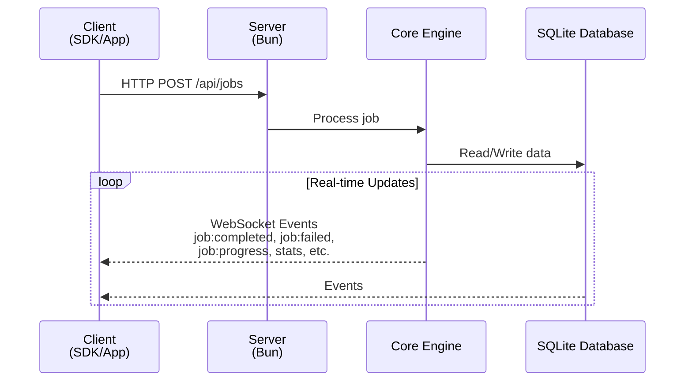

# JetQueue Architecture

## Overview

JetQueue is a modular background job processing system built with TypeScript. It consists of five core packages that work together to provide a complete job queue solution, from task definition to execution monitoring.

---

## Package Structure

### `@jet-queue/core`

The heart of JetQueue – a standalone queue engine that handles all job lifecycle management.

- **Job lifecycle management**: Create, track, update, and remove jobs
- **Retry logic**: Fixed, linear, and exponential backoff strategies
- **Storage abstraction**: In-memory by default, with SQLite persistence (built into Bun/Node.js)
- **Event system**: Emits typed events for every job state change
- **Priority queue**: Four priority levels (critical > high > normal > low)
- **Concurrency control**: Configurable worker pool size

**Dependencies**: None (pure TypeScript)

---

### `@jet-queue/server`

A ready-to-use Bun server that wraps the core engine with REST and WebSocket APIs.

- **REST endpoints**: Job submission, retrieval, cancellation, retry, stats, and health checks
- **WebSocket server**: Real-time job events (start, complete, fail, progress, stats updates)
- **Built-in SQLite persistence**: Jobs persist between server restarts (using Bun/Node.js SQLite)
- **Ready to run**: Zero-configuration setup for development and production
- **Customizable**: Developers can extend or replace with their own server implementation

**Dependencies**: `@jet-queue/core`, Bun runtime

---

### `@jet-queue/client`

TypeScript/JavaScript SDK for interacting with JetQueue servers.

**Capabilities**:

- Submit jobs with full configuration (priority, delay, retry, timeout, tags, metadata)
- Subscribe to job events via WebSocket (progress, completion, failure, etc.)
- Fetch job status, stats, and list jobs
- Cancel or retry existing jobs
- Type-safe API with full TypeScript support
- Works in any environment: Node.js, Bun, browsers, edge functions

**Dependencies**: None (pure TypeScript)

---

### `@jet-queue/cli`

Terminal-based dashboard for server management.

**Features**:

- View queue stats (pending, running, completed, failed, delayed, total)
- List and filter jobs by status or tags
- Inspect job details (data, metadata, error messages)
- Cancel or retry jobs directly from the terminal
- Monitor real-time job progress
- Connect to local or remote servers

**Dependencies**: `@jet-queue/client`

---

### `@jet-queue/dashboard`

Web-based administrative UI built with Next.js.

**Features**:

- Real-time job monitoring with auto-refresh
- Visual queue statistics and charts
- Job search and filtering (by status, tags, name)
- Detailed job inspection with expandable data/error views
- Manual job management (cancel, retry, add)
- Responsive design for desktop and mobile

**Dependencies**: `@jet-queue/client`, Next.js

---

## Core Domain Model

### Job States

```typescript
type JobStatus =
  | "pending" // Waiting in queue
  | "running" // Currently executing
  | "completed" // Finished successfully
  | "failed" // Failed (will stay in this state until manual retry)
  | "delayed" // Scheduled for future execution
  | "cancelled"; // Manually cancelled
```

### Job Configuration

Each job supports:

- **Priority**: `critical` (0) > `high` (1) > `normal` (2) > `low` (3)
- **Retry strategies**: Fixed, linear, or exponential backoff
- **Timeout**: Per-job execution time limit
- **Delay**: Schedule for future execution
- **Max attempts**: Retry limit before marking as failed
- **Tags & Metadata**: For filtering and custom data

## Data Flow



### Step-by-Step Flow

1. Job Submission
  - Client calls `client.addJob()` with job data and options
  - HTTP request sent to `POST /api/jobs`
  - Server validates and passes job to Core engine
  - Core stores job in SQLite and adds to queue
  - Server returns job ID to client
2. Job Processing
  - Core engine picks next job based on priority and concurrency limits
  - Job status transitions: pending → running
  - Task function executes with configured timeout
  - Progress updates can be emitted during execution
3. Completion
  - Success: Status → completed, result stored
  - Failure: Status → failed, error stored
  - All state changes persisted to SQLite
4. Real-time Updates
  - Core emits events for every state change
  - Server broadcasts events via WebSocket to connected clients
  - Clients receive typed events in real-time

## Design Principles

1. **Modular** – Each package can be used independently
2. **Simple** – Zero-config defaults, easy to extend
3. **Type-safe** – Full TypeScript with strict typing
4. **Event-driven** – Real-time updates for all state changes
5. **Persistent by default** – SQLite ensures jobs survive restarts
6. **Developer-first** – Clear API, excellent dev experience